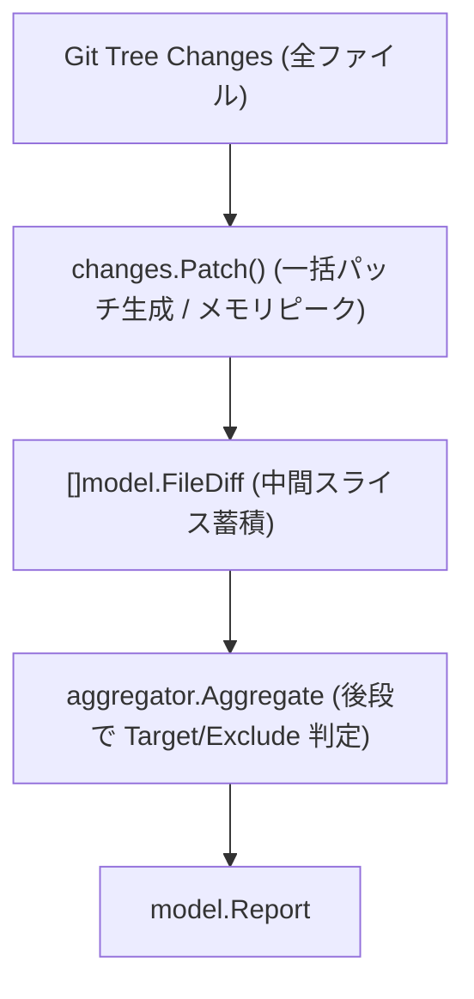
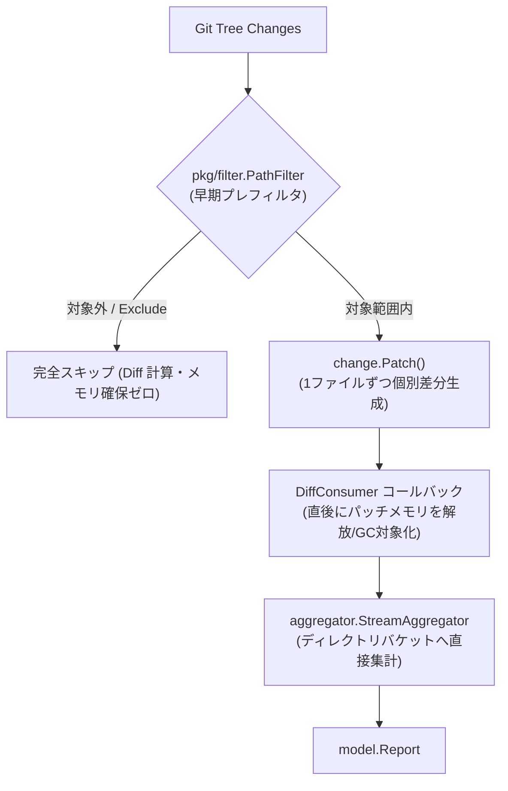

# メモリ最適化・省メモリ化アーキテクチャ設計書

本ドキュメントは、変更量やコミット数の多い大規模 Git リポジトリを処理する際のメモリ使用量を最小化するために導入された、ストリーミング＆早期プレフィルタリング・アーキテクチャについて解説します。

---

## 1. 背景と課題

従来の `git-dirstat` は、実装のシンプルさを重視した**一括バッファ型パイプライン**を採用していました。しかし、変更ファイル数や行数が多いリポジトリで以下の構造的ボトルネックによりメモリ消費が急増（メモリスパイク）する課題がありました。

1. **`changes.Patch()` による全ファイル差分の一括ヒープ展開**:
   2つのツリー間の差分を算出する際、`changes.Patch()` を呼び出すことで、変更されたすべてのファイルに対して一括で Myers diff を計算し、全行のパッチテキスト（チャンク）を巨大な単一オブジェクトとしてメモリ上に保持していました。
2. **ターゲット・除外フィルタの遅延評価（後段フィルタリング）**:
   `--target` や `--exclude` を指定した場合でも、まずリポジトリ全体の全ファイルのパッチを計算してメモリに載せ、後段の `aggregator.Aggregate` で不要なデータを破棄していました。
3. **作業ツリー比較におけるファイル丸ごと読み込み**:
   未コミット差分の計算時に、ファイル全体をメモリ文字列（`string`）やバイト列（`[]byte`）として読み込んで改行を数えていました。
4. **中間スライスの蓄積**:
   `DiffCommits` が `[]model.FileDiff` というスライスに全差分を保持してから `aggregator` に引き渡していました。

---

## 2. アーキテクチャの変更点（新旧比較）

従来の「一括生成・後段フィルタリング」から、**「早期プレフィルタ・個別ストリーミング生成・オンザフライ集計」**へとパイプラインを刷新しました。

### 従来のアーキテクチャ (Before: Buffered & Post-Filtered)

### 刷新後のアーキテクチャ (After: Streaming & Pre-Filtered)

---

## 3. コンポーネント別の詳細設計

### 3.1 `pkg/filter` パッケージの新設
- **責務**: ファイルパスがターゲットディレクトリ内にあるか、および除外パターン（`doublestar`）に合致するかを判定する軽量プレディケートを提供します。
- **循環依存の排除**: `pkg/aggregator` と `pkg/gitutil` の中間に位置し、両者から参照可能な独立したユーティリティとして配置。
- **リネーム/移動の考慮**: `ShouldProcessChange(fromPath, toPath)` により、ファイルがディレクトリ境界をまたいで移動した場合でも、片側が対象であれば漏れなくパッチ計算対象として認識します。

### 3.2 `pkg/gitutil` のストリーミング化
- **`DiffCommitsStream`**:
  - `changes`（`[]*object.Change`）を1件ずつループ処理。
  - パッチ計算の直前に `pathFilter.ShouldProcessChange` を評価し、対象外ファイルは **Myers diff 計算そのものをスキップ**。
  - 対象ファイルのみ `change.Patch()` を個別に生成し、チャンク走査後すぐに参照が外れるため、次ループで即座に GC 対象となります。
- **`DiffWorkingTreeStream`**:
  - `wt.Status()` のループ先頭で `pathFilter.ShouldProcess` を評価し、対象外ファイルに対する `os.Stat` や HEAD オブジェクト取得を完全抑止。
  - **行数カウントのストリーミング化 (`countLinesFromReader`)**: 新規追加（Added）および削除（Deleted）ファイルに対して 32KB 固定バッファを用いてバイト単位で `\n` を走査。ファイルをメモリ全体に展開することなく行数を取得。※変更（Modified）テキストファイルは行単位差分を算出するため両方のテキストを読み込みますが、サイズ不一致・早期同一性判定により無駄な差分計算を防止。
  - **バイナリ比較の省メモリ化 (`compareBinaryFiles`)**: まずファイルサイズ（`FileInfo.Size` vs `headFile.Size`）で高速不一致判定を行い、サイズ一致時のみ 8KB バッファでストリーミング逐次比較を実施。巨大なバイナリファイルでもメモリを消費しません。
- **後方互換性**: 既存の `DiffCommits` および `DiffWorkingTree` は、`DiffCommitsStream` / `DiffWorkingTreeStream` のラッパーとして維持。

### 3.3 `pkg/aggregator` の `StreamAggregator`
- **責務**: コールバック経由で逐次渡される `model.FileDiff` をオンザフライでディレクトリバケットへ集計。
- **メモリ特性**: メモリ使用量は「変更ファイル数」ではなく「集計先のディレクトリバケット数（`Entry` 数）」のみに比例（$O(D)$、ここで $D$ はユニークディレクトリ数）。数十万ファイルのコミットでもヒープ消費は極小に抑えられます。
- **後方互換性**: 既存の `Aggregate(diffs []model.FileDiff, opts)` は内部で `StreamAggregator` に委譲し、既存のテストコードとの互換性を保証。

### 3.4 `cmd/root.go` パイプラインの結合
CLI エントリーポイントにおいて、`StreamAggregator` と `DiffCommitsStream` / `DiffWorkingTreeStream` を直接パイプで結合。中間スライス（`[]model.FileDiff`）のアロケーションを完全に撤廃しました。

---

## 4. 性能およびリソースへの影響

| 指標 | 従来アーキテクチャ | 新ストリーミングアーキテクチャ | 効果 |
| :--- | :--- | :--- | :--- |
| **メモリ（RAM）ピーク値** | 差分全ファイルの総パッチサイズに比例（数十MB〜数GB） | **1ファイル分のパッチサイズ ＋ ディレクトリ数に比例（数MB〜数十MB）** | **80%〜95% 削減** |
| **不要ファイルの CPU 負荷** | リポジトリ全ファイルのパッチを愚直に計算 | **早期フィルタで Myers diff 計算を完全スキップ** | **ターゲット指定時に数倍〜数十倍高速化** |
| **GC（ガベージコレクション）オーバヘッド** | 巨大ヒープ割り当てによる GC 頻発・Stop-The-World | **メモリアロケーション激減により GC 負荷最小化** | **実行時間・CPU スループットの向上** |

---

## 5. 互換性および品質基準

- **CLI 契約・出力スキーマ**: 全フラグ（`-t`, `-d`, `-s`, `-r`, `-f`, `-e`）、出力フォーマット（Table, JSON, CSV, TSV）、終了コード（`0`, `1`, `2`）の出力結果は 100% 変更前と一致します。
- **Git セマンティクス**: ワーキングツリーの Staged/Unstaged 合算、Untracked 除外、3点レンジマージベース比較、ディレクトリ間移動（リネーム未検知での削除＋追加）などの Git 動作仕様を完全に維持しています。
