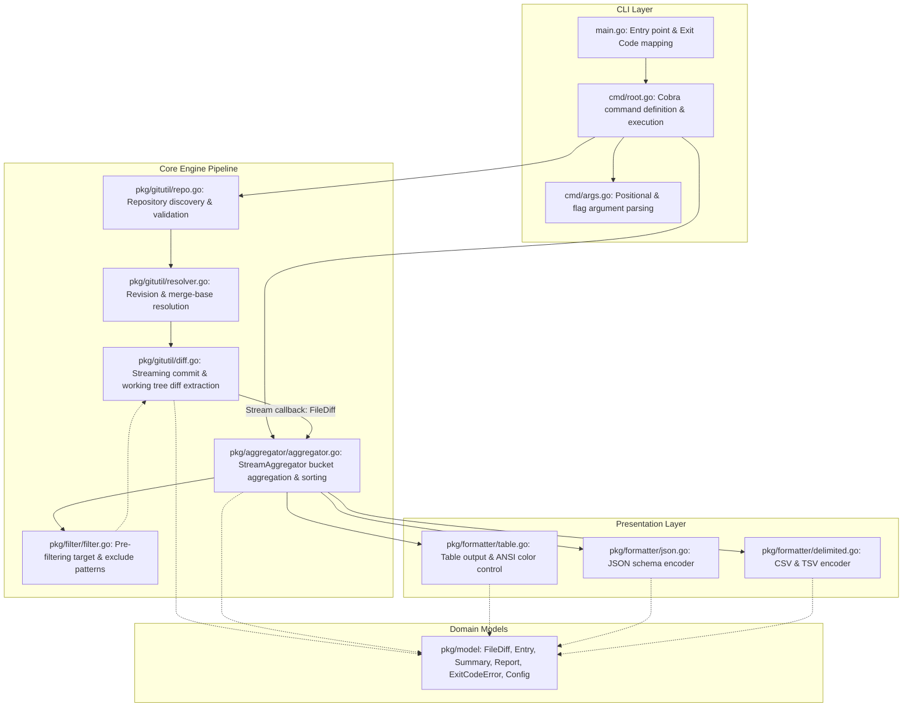
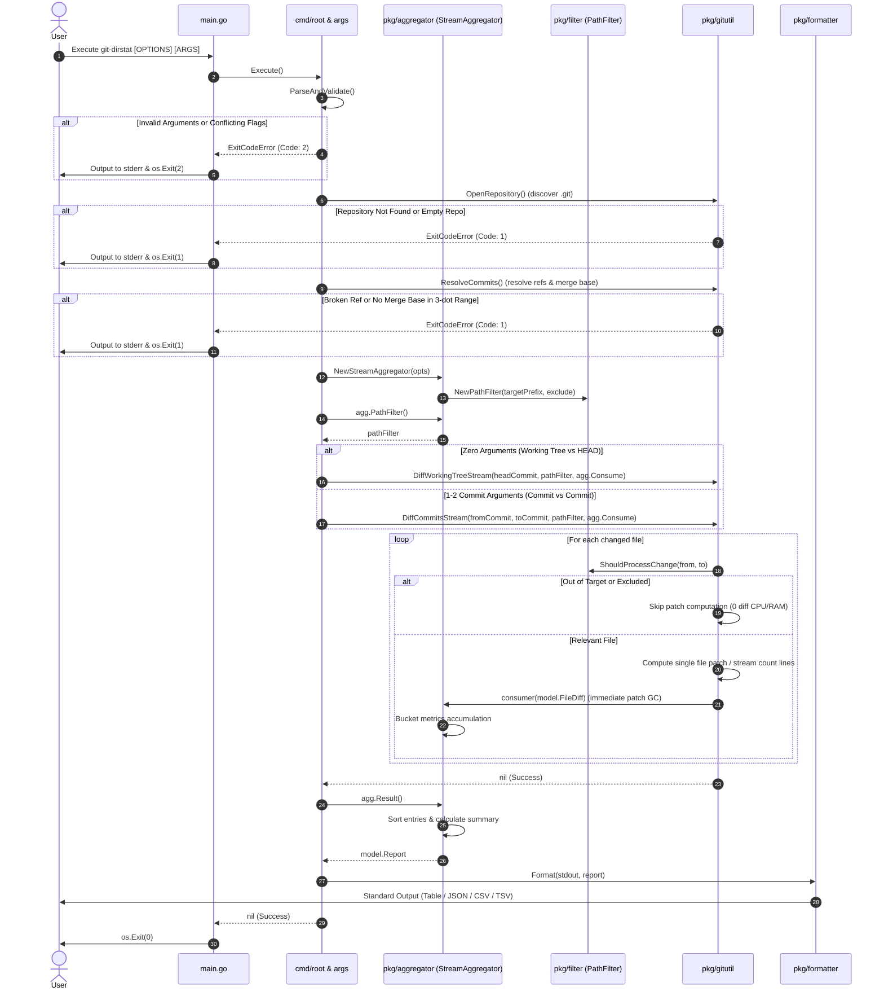

# Software Design Document: git-dirstat

## 1. Introduction

### 1.1 Purpose
This document specifies the software architecture, modular decomposition, data models, and internal control flows for `git-dirstat`, a command-line tool that inspects changes in Git repositories and aggregates modifications by directory. It provides technical design specifications based on [`docs/git-dirstat-spec.md`](git-dirstat-spec.md).

### 1.2 Design Goals & Principles
- **Pure Go & Zero CGO Dependencies**: Operates as a completely self-contained static binary without requiring the native `git` CLI or external C libraries installed on the host machine.
- **Unidirectional Pipeline Architecture**: Adheres to a clean, decoupled data pipeline: `CLI Input Resolution -> Git Diff Extraction -> Path Normalization & Depth Aggregation -> Presentation Formatting`.
- **Strict Git Semantic Fidelity**: Faithfully mirrors Git's standard range notations (`..`, `...`), merge base computation, and working tree diff mechanics (combining staged and unstaged changes while ignoring untracked files).
- **Deterministic Error & Exit Code Contracts**: Strictly enforces exit codes (`0` for success, `1` for Git/runtime errors, `2` for user input errors) to ensure seamless integration into shell scripts and CI/CD pipelines.

---

## 2. System Architecture & High-Level Design

### 2.1 Layered Architecture
The application is structured into four primary layers: the CLI Layer, Core Engine Pipeline, Domain Models, and Presentation Layer.



### 2.2 Pipeline Data Flow

```text
[CLI Arguments & Flags]
       │
       ▼ (cmd.ParseAndValidate)
[model.Config: Target, Depth, Sort, Reverse, Exclude, Format, CommitOpts]
       │
       ▼ (gitutil.ResolveCommits)
[ResolvedCommits: baseCommit, toCommit, isWorkingTree]
       │
       ▼ (aggregator.NewStreamAggregator & PathFilter)
[filter.PathFilter: TargetPrefix, ExcludePatterns]
       │
       ▼ (gitutil.DiffCommitsStream / DiffWorkingTreeStream with Pre-Filter)
[Stream callback: model.FileDiff (individual patch GC)]
       │
       ▼ (aggregator.Consume on-the-fly)
[model.Report: Target, Depth, Summary, []Entry]
       │
       ▼ (formatter.Format)
[Standard Output: Table / JSON / CSV / TSV]
```

---

## 3. Detailed Package & Module Design

### 3.1 `cmd` Package (CLI Interface)
- **Responsibilities**:
  - Command-line flag parsing, validation, and default value assignment using Cobra.
  - Processing commit specifications and positional arguments.
  - Enforcing mutual exclusivity and syntax correctness.
- **Key Modules**:
  - `cmd/root.go`: Initializes the root Cobra command (`NewRootCommand`). Executes the end-to-end pipeline in `RunE`. Directs formatted output to `cmd.OutOrStdout()`.
  - `cmd/args.go`:
    - Separates commit arguments from `-- <target-path>` using `cmd.ArgsLenAtDash()`.
    - Prohibits simultaneous specification of `-t / --target` and `-- <target-path>` (Exit Code 2).
    - Parses 0-arg, 1-arg (`<commit>`), 2-arg (`<c1> <c2>`), two-dot (`..`), and three-dot (`...`) ranges. Automatically defaults omitted sides (e.g., `..feature`, `main..`) to `HEAD`.
    - Loads external exclude pattern files specified via `--exclude-from` / `--exclude-file` via `filter.LoadPatternsFromFile`, merging them into `Config.Exclude`. Non-existent or unreadable files fail immediately with Exit Code 2.
    - Enforces `--depth >= 1`, valid sort fields (`files`, `added`, `deleted`, `net`, `path`), and supported formats (`table`, `json`, `csv`, `tsv`).

### 3.2 `pkg/model` Package (Domain Entities)
- **Responsibilities**: Defines immutable data models, configuration structs, and domain errors shared across packages, with zero external dependencies.
- **Key Types**:
  - `Config`: Validated execution configuration.
  - `CommitOptions`: Parsed commit range type (`CommitSpecType`) and ref strings.
  - `FileDiff`: Granular file-level modifications (`Path`, `Added`, `Deleted`, `IsBinary`).
  - `Entry`: Directory bucket metrics (`Path`, `IsRoot`, `Files`, `Added`, `Deleted`, `Net`).
  - `Summary`: Overall totals (`TotalFiles`, `TotalAdded`, `TotalDeleted`, `Net`).
  - `Report`: Top-level report containing target, depth, summary, and entries.
  - `ExitCodeError`: Carries integer exit codes (`1` or `2`) conforming to Go's `error` interface.

### 3.3 `pkg/filter` Package (Pre-filtering)
- **Responsibilities**: Provides fast target boundary matching and `doublestar/v4` glob exclusion checks used by the git engine to skip unneeded diff computations, as well as pattern file loading.
- **Key Modules**:
  - `filter.go`:
    - `PathFilter`: Evaluates target directory prefix and exclusion patterns.
    - `ShouldProcess(path)`: Evaluates single path inclusion.
    - `ShouldProcessChange(from, to)`: Evaluates change pairs, safely handling file moves/renames across target boundaries.
    - `LoadPatternsFromFile(filePath)`: Reads glob patterns from an external file line-by-line, ignoring whitespace, empty lines, and `#` comments.

### 3.4 `pkg/gitutil` Package (Git Engine)
- **Responsibilities**: Interacts with Git repositories via `go-git/v5` without spawning external processes.
- **Key Modules**:
  - `repo.go`:
    - `OpenRepository(startPath)`: Discovers `.git` upward from CWD with `DetectDotGit: true` and `EnableDotGitCommonDir: true` (guaranteeing seamless compatibility with `git worktree` environments by traversing `commondir` references).
    - Verifies `repo.Head()`. If `.git` is not found or repository has zero commits, terminates with Exit Code 1.
  - `resolver.go`:
    - Resolves revisions (short/full SHA hashes, tags, branches, `HEAD~n`) via `repo.ResolveRevision()`.
    - Computes merge bases for three-dot ranges (`...`) using `c1.MergeBase(c2)`. If no common ancestor exists, fails with Exit Code 1.
  - `diff.go`:
    - `DiffCommitsStream(fromCommit, toCommit, filter, consumer)`: Streams tree diffs. Evaluates pre-filtering per file before calling `change.Patch()`, completely eliminating bulk memory spikes. Patches are processed and garbage collected one by one.
    - `DiffWorkingTreeStream(repo, headCommit, repoRoot, filter, consumer)`: Traverses `wt.Status()`. Employs chunked buffer streaming (`countLinesFromReader`) for new/deleted files, and stream comparison for binary files, preventing large file allocations.
    - Backward-compatible wrappers `DiffCommits` and `DiffWorkingTree` retain support for legacy buffered consumers.

### 3.5 `pkg/aggregator` Package (Streaming Aggregation & Filtering)
- **Responsibilities**: Transforms streaming file diffs into grouped, normalized, and deterministically sorted bucket entries.
- **Key Capabilities**:
  - **Streaming Accumulator (`StreamAggregator`)**:
    - Accumulates metrics on-the-fly via `Consume(model.FileDiff)` with $O(D)$ memory complexity ($D$ = number of unique directory buckets).
    - Backward-compatible `Aggregate(diffs, opts)` delegates to `StreamAggregator`.
  - **Target Normalization & Boundary Check (`NormalizeTarget`)**:
    - Converts CWD-relative target paths to clean repository-root-relative paths.
    - Discards files outside the target path boundary before aggregation.
  - **Depth Slicing & Root File Handling (`getBucketKey`)**:
    - Splits paths relative to target by `/`.
    - Files located directly inside the target directory without subdirectories are grouped into root files (`is_root: true`).
    - Files in subdirectories are sliced up to `--depth` segments and suffixed with `/`.
  - **Metrics Accumulation**:
    - Tracks unique file sets per bucket (`map[string]struct{}`).
    - Sums `Added`, `Deleted`, and computes signed delta `Net = Added - Deleted`.
  - **Deterministic Sorting (`sortEntries`)**:
    - Sorts descending by the specified field (`added`, `deleted`, `net`, `files`, `path`).
    - Enforces ascending alphabetical tie-breaking on `path`.
    - Reverses order when `--reverse` (`-r`) is active.

### 3.6 `pkg/formatter` Package (Presentation)
- **Responsibilities**: Renders `model.Report` into target output formats implementing the `Formatter` interface.
- **Key Modules**:
  - `table.go`:
    - Dynamically computes column widths (`Directory`, `Files`, `Added`, `Deleted`, `Net`).
    - Detects TTY via `mattn/go-isatty` and applies ANSI colors (green additions, red deletions) unless `--no-color` or non-TTY.
    - Formats root files as `<target>/ (root files)` or `(root files)`. Emits a summary `TOTAL` row.
  - `json.go`:
    - Produces schema-compliant formatted JSON (`json.MarshalIndent`).
    - Guarantees `"entries": []` when no changes exist.
  - `delimited.go`:
    - Generates RFC 4180 compliant CSV (comma-separated) or TSV (tab-separated).
    - Contains header and data records only (no `TOTAL` row).

---

## 4. Process Flow & Sequence

### 4.1 End-to-End Execution Sequence



---

## 5. Error Handling & Exit Code Strategy

Following POSIX conventions and Section 7 of the specification, errors are strictly categorized:

| Exit Code | Classification | Trigger Scenarios | Implementation |
| :---: | :--- | :--- | :--- |
| `0` | **Success** | Successful execution (including zero diffs found). | `os.Exit(0)` |
| `1` | **Git / Runtime Error** | - `.git` repository directory not found<br>- Repository has no commits yet<br>- Unresolvable commit hash, broken tag/branch<br>- No common ancestor in three-dot range | `model.NewRuntimeError(format, ...)` |
| `2` | **User Input Error** | - `--depth < 1`<br>- Invalid `--sort` or `--format` options<br>- Malformed range syntax (e.g., `....`)<br>- Combining range notation with additional commits<br>- Conflicting `-t` and `-- <path>`<br>- Unrecognized flags (Cobra/pflag errors) | `model.NewInputError(format, ...)` |

- All error messages are written exclusively to `os.Stderr`.
- Cobra's `SilenceErrors: true` and `SilenceUsage: true` are configured so that `main.go` acts as the single source of truth for error reporting and exit code dispatching.

---

## 6. Testing Strategy & Quality Assurance

### 6.1 Test Levels
1. **Unit Testing**:
   - `cmd/args_test.go`: Validates all positional argument permutations, range shorthands, flag validations, and error code 2 enforcement.
   - `cmd/root_test.go`: Tests Cobra root command wiring, `--version`, `-v`, `--help`, and non-Git execution.
   - `pkg/gitutil/gitutil_test.go`: Exercises repository opening, empty repos, revision parsing, binary diffs, working tree diffs, and orphan commit merge-base errors.
   - `pkg/aggregator/aggregator_test.go`: Verifies depth slicing (depth 1 vs 2), root file bucketization, pattern exclusions, and deterministic sorting with tie-breaking.
   - `pkg/formatter/formatter_test.go`: Asserts exact output layout across Table, JSON, CSV, and TSV formats, including zero-diff handling and negative net metrics.
2. **Integration Testing (`test/e2e_test.go`)**:
   - Creates isolated Git repositories on disk to test real Git workflows: branch creation, three-dot range merge bases, staged/unstaged changes, untracked exclusion, and CLI exit codes.

### 6.2 Resource & Concurrency Safety
- File descriptors (`io.ReadCloser`) in diff extraction are explicitly closed upon completion to guarantee zero resource leakage even in large repositories.
- Memory consumption is controlled by streaming diff chunks and avoiding duplicate object tree loads.
